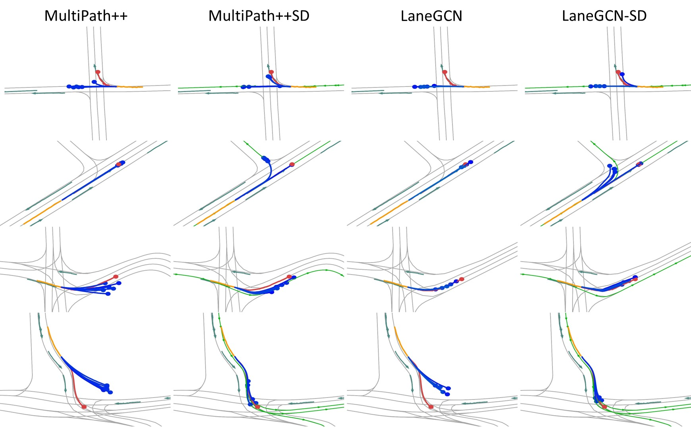

<p align="center">
    <h1 align="center">Stay on Track: A Frenet Wrapper to Overcome Off-road Trajectories in Vehicle Motion Prediction</h1>
    <h3 align="center"><a href="https://arxiv.org/abs/2306.00605">Paper</a> | <a href="#">Supplementary</a> | Code (will be added after review) </h3>
    
</p>
<br/>

> [**Stay on Track: A Frenet Wrapper to Overcome Off-road Trajectories in Vehicle Motion Prediction**](https://arxiv.org/abs/2306.00605)  <br>
> [Marcel Hallgarten](https://mh0797.github.io/)<sup>1,2</sup>, [Ismail Kisa]()<sup>2</sup>, [Martin Stoll]()<sup>1</sup> and [Andreas Zell](https://uni-tuebingen.de/fakultaeten/mathematisch-naturwissenschaftliche-fakultaet/fachbereiche/informatik/lehrstuehle/kognitive-systeme/the-chair/staff/prof-dr-andreas-zell/)<sup>2</sup>  <br>
> <sup>1</sup> Robert Bosch GmbH, <sup>2</sup> University of Tübingen

<br/>
TL;DR: We show that using a Frenet representation makes SotA motion prediction models more map compliant, i.e. significantly reduces offroad-predictions


## Abstract
> Predicting the future motion of surrounding vehicles is a crucial enabler for safe autonomous driving.
The field of motion prediction has seen large progress recently with State-of-the-Art (SotA) models achieving impressive results on large-scale public benchmarks.
However, recent work revealed that learning-based methods are prone to predict off-road trajectories in challenging scenarios.
These can be created by perturbing existing scenarios with additional turns in front of the target vehicle while the motion history is left unchanged.
We argue that this indicates that SotA models do not consider the map information sufficiently and demonstrate how this can be solved, by representing the model inputs and outputs in a Frenet frame defined by lane centreline sequences.
To this end, we present a general wrapper that leverages a Frenet representation of the scene and that can be applied to SotA models without changing their architecture.
We demonstrate the effectiveness of this approach in a comprehensive benchmark comprising two SotA motion prediction models.
Our experiments show that this reduces the off-road rate on challenging scenarios by more than 90\%,
without sacrificing average performance.


## Results
<p>

Planning results on the proposed scene-attack benchmark. Please refer to the [Paper](https://arxiv.org/abs/2306.00605/) for more details.
</p>

### Perturbation 1: Single Turn

| **Model**        |  **minADE** | **ORP** | **MR**  |
|-------------------| ------------|--------------|------------|
| [MultiPath++](https://arxiv.org/abs/2111.14973)*  | 3.139         | 65.5           | 96.5         |
| MultiPath++SD (**ours**)       | 1.388       | 3.6         | 88.0           | 
| [LaneGCN](https://arxiv.org/abs/2007.13732)        | 2.063        | 38.2         | 93.9           |
| LaneGCN-SD (**ours**)           | 1.209   | 3.1         | 85.6           |

### Perturbation 2: Double Turn

| **Model**        |  **minADE** | **ORP** | **MR**  |
|-------------------| ------------|--------------|------------|
| [MultiPath++](https://arxiv.org/abs/2111.14973)*  | 2.574         | 67.1           | 96.3         |
| MultiPath++SD (**ours**)       | 1.132       | 3.7         | 78.5           | 
| [LaneGCN](https://arxiv.org/abs/2007.13732)        | 2.372        | 63.9         | 94.4           |
| LaneGCN-SD (**ours**)           | 10.987   | 3.5         | 70.3           |

### Perturbation 3: Rippe Road

| **Model**        |  **minADE** | **ORP** | **MR**  |
|-------------------| ------------|--------------|------------|
| [MultiPath++](https://arxiv.org/abs/2111.14973)*  | 3.549         | 72.9           | 97.9         |
| MultiPath++SD (**ours**)       | 1.331       | 3.5         | 85.2           | 
| [LaneGCN](https://arxiv.org/abs/2007.13732)        | 3.094        | 61.2         | 96.2           |
| LaneGCN-SD (**ours**)           | 1.144   | 2.9         | 81.7           |

### Qualitative Results
<div align="center">

</div>
<p>
From top to bottom two original and two perturbed scenes are shown. Centrelines used by the SD models are shown in green state history in yellow. Predicted trajectories and ground truth are shown in blue and red, respectively. In the top example, the TV has just passed the branching point so that only the straight centreline is detected. The SD models are still able to predict the right-turn mode, significantly off the reference centreline. The second row demonstrates the increased diversity of SD model predictions. The third row shows deviations from the reference line. In the bottom example, the SD models adapt to a difficult perturbation, while the original models predict only off-road trajectories.
</p>


## Citation
```BibTeX
@article{hallgarten2023stay,
  title={Stay on Track: A Frenet Wrapper to Overcome Off-road Trajectories in Vehicle Motion Prediction},
  author={Hallgarten, Marcel and Kisa, Ismail and Stoll, Martin and Zell, Andreas},
  journal={arXiv preprint arXiv:2306.00605},
  year={2023}
}
```